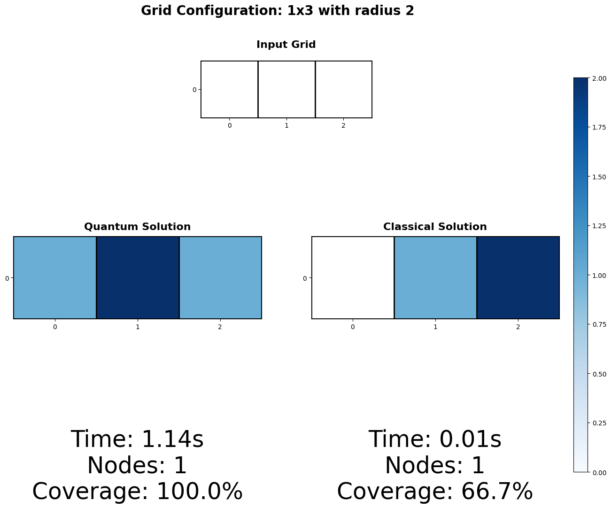

# Efficient Optimization using Quantum Computing
[comment]: <> (TODO: change title of writeup if necessary)

## Table of Contents
* [Table of Contents](#table-of-contents)
* [Introduction](#introduction)
  * [Motivation](#motivation)
  * [Objectives](#objectives)
    * [Extend Existing Research](#extend-existing-research)
    * [Open-Source Implementation](#open-source-implementation)
    * [Simplify Usability](#simplify-usability)
  * [Quantum Advantage](#quantum-advantage)
* [Methods](#methods)
  * [Algorithm](#algorithm)
  * [Circuit](#circuit)
* [Dataset and Preprocessing](#dataset-and-preprocessing) 
  * [Data Description](#data-description)
  * [Preprocessing Steps](#preprocessing-steps)
  * [Hardware Requirements](#hardware-requirements)
* [Results](#results) 
  * [Test Configurations](#test-configurations)
  * [Observations](#observations)
  * [Current Limitations](#current-limitations)
* [Conclusion](#conclusion)
  * [Future Work](#future-work)
* [Authors](#authors)
* [References](#references)
* [License](#license)


## Introduction

### Motivation
The University of Maryland has a lot of resources that it seeks to ensure every student has easy access to, ranging from facilities like Wi-fi to basic safety measures such as streetlights. However, ensuring these resources are properly distributed amongst campus can grow to be expensive considering the University’s 1,339-acre estate. This optimization algorithm aims to minimize the resources necessary to ensure the entirety of any given area is fully encompassed by whatever facility the user desires. Quantum optimization is the ideal way to accomplish this task as classical optimizers are unable to provide as efficient of a solution due to the risk of getting trapped in local minima and the significantly weaker processing ability. The poorer performance of the classical optimizer is demonstrated in our results.

### Objectives
#### Extend Existing Research
This project aims to implement and extend the work done in [*Efficient Light Source Placement Using Quantum Computing*](https://doi.org/10.48550/arXiv.2312.01156). The paper uses Quadratic Unconstrained Binary Optimization (QUBO) with Quantum Annealers to optimize the placement of light sources in a grid-like environment, in this case the game Minecraft is tested. The paper's results suggest practical results outside the video game.

#### Open-Source Implementation
Our primary objective is to release an open-source implementation of the methods used to optimize the placement of nodes or points of interest. This project aims to recreate the functionality of the original code, making it freely available for experimentation. While the previous work was designed to run on a Quantum Annealer provided by D-Wave and did not include publicly available code, our implementation offers a more accessible version of the outlined computing techniques.

#### Simplify Usability
Moreover, a web app is currently in development to simplify the usability of the paper as a tool for optimizing the placement of nodes throughout the campus of the University of Maryland, College Park. This web tool is designed to make it easier for users to test and experiment with the optimization techniques, even with current hardware limitations. The node optimization can be extrapolated for multiple use cases (network access points, emergency blue poles, etc.). This project aims to lay the groundwork for future developments in quantum computing that are more capable of handling such tasks.


### Quantum Advantage
This optimization problem particularly benefits from quantum computing approaches for several key reasons. First, classical optimizers often struggle with getting trapped in local minima when solving QUBO problems, while quantum approaches like QAOA can better explore the global solution space through quantum superposition. Second, the binary nature of node placement (1 for placed, 0 for empty) maps naturally to quantum bits, making this an ideal use case for quantum computing. Finally, our hybrid quantum-classical ADMM approach allows us to maintain these quantum advantages while working within current hardware limitations. While processing time is currently longer on quantum hardware, the algorithm consistently achieves better coverage quality compared to classical methods, as demonstrated in our Results section. This suggests that as quantum hardware continues to improve, the performance advantages will become even more pronounced while maintaining superior solution quality.

## Methods

### Algorithm 
The code creates a 2D matrix filled with 0s and places nodes with an optional radius and distance metric to generate the input matrix D as described above. A constraint function $`c(x,z)`$ and the function we are seeking to optimize $`L(x, z, \lambda, \mu)`$ are defined as determined prior. Parameters are initialized and used to set up the ADMM optimizer with a quantum approximate optimization algorithm that can be substituted for an actual quantum computer backend. 

We then loop through the using an algorithm to update the quantum problem each iteration based on update criteria described in the paper. The linear and quadratic terms are isolated to define the quadratic program to be optimized.

[comment]: <> (*Describe how z* is updated*)
[comment]: <> (*Describe how lambda is updated*)
[comment]: <> (*Describe how mu is updated* )

A result is printed with each iteration and a final result is printed after k loops as specified by the user. The output is a binary matrix that dictates where light sources should be placed with 1 and empty locations with 0. The optimization algorithm seeks to cover the entire area with the fewest light sources possible. 

Our implementation follows a similar methodology to the paper.
The problem can be defined as the QUBO formulation:

```math 
\begin{align}
& \min_{x\in \{0, 1 \}^n } && 1^\intercal x &&& \newline 
& \text{subject to } &&  Dx - 1 - z, &&& z \in \mathbb{N}^n _0
\end{align}
```

Such that $`D\in\{0,1\}^{n\times{n}}`$ with entry $`d_{ij}`$ representing if the location at $`(i, j)`$ is in range of the closest node, $`x`$ being a candidate solution, and $`z`$ being an auxillary vector.

In order to use fewer qubits, the Alternating Direction Method of Multipliers (ADMM) is used to create a hybrid quantum-classical problem. The problem can be rewritten as

```math
\begin{align}
& \min_{x\in \{0, 1 \}^n , z \in \mathbb{Z}^n} && 1^\intercal x + \gamma 1^\intercal \Theta (z )&&& \newline 
& \text{subject to } &&  c(x, z) = 0 &&& 
\end{align}
```

Such that $`c(x, y) = Dx - 1 - z$, $\gamma > 0`$, and $`\Theta (z)`$ representing a binary vector $`( \{z_0 < 0\}, ... , \{z_n < 0\} )`$. This penalizes negative $`z`$ values, as from equation $`(2)`$,  $`z \in \mathbb{N}^n _0`$.

The augmented lagrangian can then be created as:

```math
\begin{align}
L(x, z, \lambda, \mu) := 1^\intercal x + \gamma 1^\intercal \Theta (z) + \mathbb{\lambda}^\intercal c(x, z) + \frac{\mu}{2}\|c(x, z)\|^2
\end{align}
```

Such that $`\lambda`$ and $`\mu`$ are coefficients and multipliers for the penalty terms. Thus we follow the algorithm:

```math
\displaylines{
 \textbf{repeat}\\
 x^* \leftarrow \mathbb{\text{arg min}} _x L(x, z^*, \lambda^*, \mu^*)\\
 z^* \leftarrow \mathbb{\text{arg min}} _z L(x^*, z, \lambda^*, \mu^*)\\
 \lambda^x \leftarrow \lambda^* + \mu^*c(x, z)\\
 \mu_{k+1} \leftarrow

 \begin{cases}
 \rho \mu_k & \text{if} & \|c(x_k, z_k)\| > 10 \|D(z_k - z_{k+1})\|\\
\frac{\mu_k}{\rho} & \text{if} & 10 \|D(z_k - z_{k+1})\| >  \|c(x_k, z_k)\|\\
\mu_k & \text{else}
 \end{cases}\\
 \text{until convergence}
}
```

Such that $`\rho \ge 1`$ is a fixed learning rate. A quantum computer is used in our implementation when updating $`x^*`$. This implementation uses $`\mu_0 = 1`$ and $`\rho = 1`$.

[comment]: <> (TODO: add argument handling?)
[comment]: <> (TODO: containerize so it can be run from source)

### Circuit
The circuit is made up of Hadamard gates applied on each qubit. Hadamard gates set a qubit into a superposition, essentially meaning that they have no definite value but instead must be “observed” to get the value, either a 0 or a 1. 

Next, a Z rotation is applied first to every qubit. A Z gate rotates the qubit in the Z direction. Usually, this rotation is 180 degrees (pi radians) in the specified direction on the Bloch sphere. In this case, the rotations are instead of an input value (as seen by the t in the exponential) via the usage of an RZ gate. 

Similarly, there are now sets of rotations that affect two qubits simultaneously in the Z direction, going through every possible set of two qubits. 

Finally, X rotations are applied to each qubit using an RX gate, which functions similarly to the RZ gate above, but instead rotates the qubits over the X direction on the Bloch sphere. 

It appears that these rotations are finding what is the minimum energy level of the function, similar to how an annealer works. The Z rotations are the quadratic terms (when applied to a single qubit, these are when the quadratic term is the corresponding variable squared), and they are multiplied by a function of theta. When the value of that multiplication is minimal, then we get the most optimal values. Similarly, the X rotations are the linear terms. 

<div style="text-align: center;">
  
  <p><em>Above is an example for optimizing a 1x3 area</em></p>
</div>

## Dataset and Preprocessing

### Data Description
The input data consists of a 2D grid representation where each cell can either contain a node (1) or be empty (0). Key frameworks used:

- **Qiskit**: Core quantum library for quantum circuit creation and optimization
- **OR-Tools**: Google's optimization library for classical solution comparison
- **Matplotlib**: For visualization and plotting of results

The grid dimensions tested include:
- 1×3 (area=3)  
- 2×2 (area=4)
- 1×5 (area=5)
- 2×3 (area=6)

Each node has a configurable radius of effect, similar to how a torch<sup>[1](https://arxiv.org/abs/2312.01156)</sup> illuminates surrounding blocks.

### Preprocessing Steps
1. Grid Creation: The `create_matrix()` function initializes an empty grid of specified dimensions
2. Dimension Flattening: The 2D grid is converted to a 1D representation using `flatten_2D_to_1D()`
3. Result Processing: Solutions are converted back to 2D using `unflatten_1D_to_2D_matrix()`

### Hardware Requirements
The current implementation requires 2^k qubits, where k is the total area of the grid. For example:
- 1×3 grid: 2³ = 8 qubits
- 1×5 grid: 2⁵ = 32 qubits
- 2×3 grid: 2⁶ = 64 qubits

This exponential scaling currently limits the maximum grid size that can be processed.

## Results

### Test Configurations
The algorithm has been tested on various grid configurations:
- Small linear grids (1×3, 1×5)
- Square grids (2×2)
- Rectangular grids (2×3)

<p align="center">
  
  
  
  
</p>


### Observations
- Quantum algorithm tends to maintain complete coverage; classical methods may underestimate nodes needed.
- Quantum approach takes significantly longer due to current hardware limitations, even when coverage and node placements are similar.

### Current Limitations
1. Grid Size: The exponential qubit requirement (2^k) limits testing to small grids.
2. Hardware Access: Currently using COBYLA optimizer as the quantum backend.
3. Processing Time: Larger grids require significantly more computational resources.

## Conclusion
### Future Work

[comment]: <> (TODO: Summary: Briefly summarize your project's key findings and their significance.)
[comment]: <> (TODO: Discuss the potential broader impact of your work in the field of quantum machine learning.)

Since this work describes how things can be optimized over discrete spaces, it can be expanded to cover almost any resource. For example, for the idea of optimally spreading out wifi signal sources above, this work can be expanded to include varying ranges for different areas, work with non-square base shapes, and perhaps expand to a much larger area. Since this work does not use quantum annealing, this work can also be expanded to use an actual quantum annealer, or perhaps other algorithms with quantum computers that are more efficient or take less time to compute. Finally, since this program does take a large amount of processing power, having it run passively on a computer (such as a cluster) would be a great way to expand the scale of the project without requiring a large upgrade in the quantum computers that are accessible. 


## Authors
Arnav Dayal \
Raghava Kalidindi \
Miles Moosavi \
Sohan Kosuru

[comment]: <> (TODO: authors and umd credits)

## References
Mücke, S., & Gerlach, T. (2023). Efficient Light Source Placement using Quantum Computing. ArXiv (Cornell University), 3630. CEUR Workshop Proceedings. https://doi.org/10.48550/arxiv.2312.01156


## License
TBD

[comment]: <> (TODO: Choose license probably MIT)
